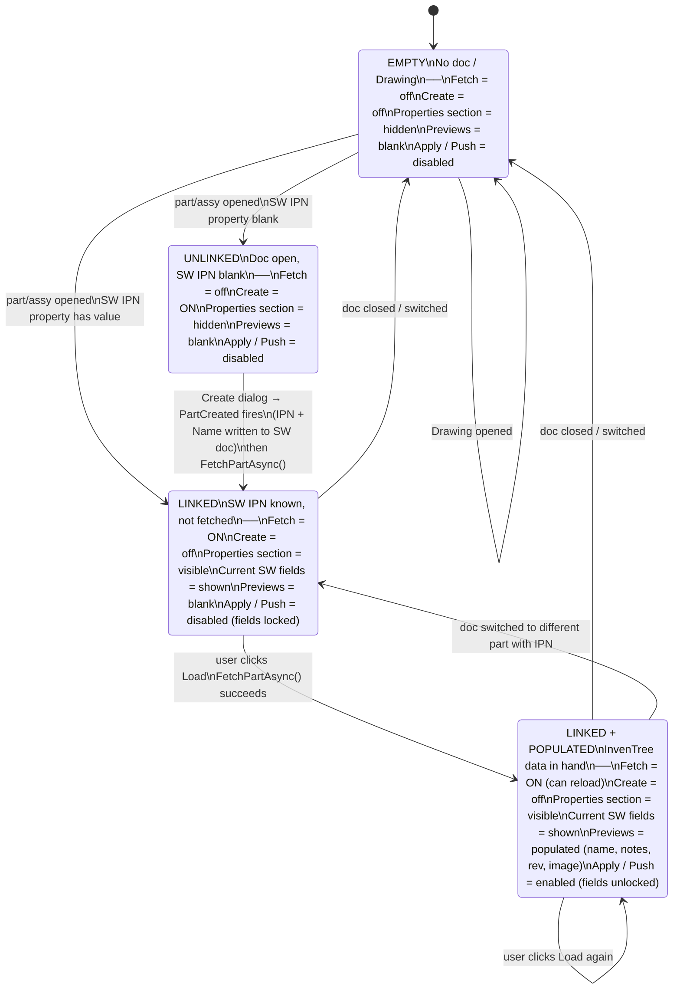

# Architecture

Module map of the add-in. Update this when files are added or deleted.

## Source tree

```
SwInventreeAddin/
  AssemblyInfo.cs             -- assembly metadata
  RevisionComparer.cs         -- static: compare two revision strings (numeric / alpha / dot-numeric); returns Equal / SwIsNewer / ItIsNewer / Ambiguous
  AddIn/
    SwAddin.cs                -- COM entry point, SolidWorks lifecycle, event wiring
  Bom/
    BomDiffEngine.cs          -- diffs SwBomLine list vs InventreeBomLine list into BomDiffLine list (7 states)
    BomDiffLine.cs            -- data class: one compared BOM row (SW line, IT line, state, selection flag)
    BomDiffState.cs           -- enum: Match / SwOnly / ItOnly / QuantityMismatch / ReferencesMismatch / BothMismatch / Conflict
    InventreeBomLine.cs       -- data class: InvenTree BOM line (BomLinePk, SubPartPk, SubPartIpn, Quantity, Reference)
    SwBomLine.cs              -- data class: SolidWorks BOM line (IPN, Quantity)
  Config/
    IConfigProvider.cs          -- interface: GetServerConfig / SaveServerConfig
    ServerConfig.cs             -- data class: Url + ApiKey + MappingSourcePath (nullable) + BomKeyword
    EncryptedConfigProvider.cs  -- DPAPI-encrypted file in %AppData%
    IPropertyMappingProvider.cs -- interface: GetMapping / SaveMapping / CopyToLocal / IsReadOnly
    PropertyMappingConfig.cs    -- data class: SW property-name fields + BOM column aliases + schema version
    PropertyMappingProvider.cs  -- JSON file I/O; local-file > source-path > first-run-defaults
  InvenTree/
    IInventreeClient.cs         -- interface: GetPartByIpnAsync / GetPartByPkAsync / GetPartsByIpnAsync /
                                --   UpdatePartRevisionAsync / UpdatePartNameAsync / UpdatePartNotesAsync /
                                --   UpdatePartDescriptionAsync / UploadPartImageAsync / DownloadImageAsync /
                                --   GetServerInfoAsync / GetCategoriesAsync / CreatePartAsync /
                                --   GetBomAsync / CreateBomLineAsync / UpdateBomLineAsync
    InventreeHttpClient.cs      -- real HTTP client (System.Net.Http + System.Text.Json)
    InventreePart.cs            -- data class: Pk, Name, Notes, Revision, Ipn, Description, ThumbnailUrl, Assembly
    InventreeBomLine.cs         -- data class: BomLinePk, SubPartPk, SubPartIpn, Quantity, Reference
    InventreeCategory.cs        -- data class: Pk, Name, ParentPk, PathString
    InventreeServerInfo.cs      -- data class: version string from /api/
    IInventreeTokenService.cs   -- interface: GetTokenAsync (username + password → API token)
    InventreeTokenService.cs    -- HTTP POST to /api/user/token/
  SolidWorks/
    DocumentType.cs             -- enum: Unknown / Part / Assembly / Drawing
    IDocumentPropertyService.cs -- interface: get/set custom properties, document type
    IViewportCaptureService.cs  -- interface: capture viewport as Image
    IAssemblyBomService.cs      -- interface: GetBomLines (reads SW assembly BOM table)
    SwDocumentPropertyService.cs -- real SolidWorks implementation
    SwViewportCaptureService.cs -- real SolidWorks implementation (SaveBMP)
    SwAssemblyBomService.cs     -- reads SW BOM table by keyword; returns SwBomLine list
  UI/
    TaskPaneControl.cs          -- ElementHost shim: wraps TaskPaneView for SolidWorks HWND
    TaskPaneView.xaml           -- WPF layout for the task pane
    TaskPaneViewModel.cs        -- MVVM: fetch, compare, apply, push, BOM state (~1000 lines; M3 split planned)
    BomCompareWindow.xaml       -- WPF modal: side-by-side BOM diff table with per-line push selection
    BomCompareViewModel.cs      -- MVVM: fetch IT BOM, run diff, push selected lines
    CreatePartWindow.xaml       -- WPF modal: category tree + name/IPN input for new part creation
    CreatePartViewModel.cs      -- MVVM: category tree load, part creation, IPN poll
    CategoryNode.cs             -- tree node data class for category picker
    SettingsWindow.xaml         -- WPF modal: server URL, API key, property mapping source
    PropertyMappingEditorWindow.xaml -- WPF modal: edit/save the property name mapping JSON
    PushRevisionConfirmDialog.xaml   -- WPF confirmation with image checkbox
    ImageCropWindow.xaml        -- WPF modal crop/preview dialog for viewport screenshots
    DesignTokens.xaml           -- shared colours, brushes, button styles
    CropGeometry.cs             -- pure C# crop math (no UI dependency)
    ImagePipeline.cs            -- static: crop -> resize (800x800 max) -> PNG encode
    ByteArrayToBitmapImageConverter.cs -- IValueConverter: byte[] -> BitmapImage for thumbnail binding
```

## Data flow

1. SolidWorks loads SwAddin -> reads encrypted settings -> creates HTTP client
2. User opens a part -> SwAddin fires LoadPartNumber -> panel shows current properties
3. User clicks Fetch -> TaskPaneViewModel calls IInventreeClient -> displays comparison
4. User clicks Apply -> TaskPaneViewModel calls IDocumentPropertyService -> writes to part
5. User clicks Push Rev -> TaskPaneViewModel calls IInventreeClient.UpdatePartRevisionAsync
6. User clicks Push Image -> capture viewport -> ImageCropWindow -> ImagePipeline -> IInventreeClient.UploadPartImageAsync
7. User opens assembly -> task pane shows BOM section with table name and diff count
8. User clicks Compare BOM -> BomCompareWindow opens -> BomCompareViewModel calls IAssemblyBomService (SW BOM) + IInventreeClient (IT BOM) -> BomDiffEngine diffs them -> window shows per-line table
9. User selects lines and clicks Push -> BomCompareViewModel calls CreateBomLineAsync / UpdateBomLineAsync for each selected line

## Task pane state machine



**Single source of truth for the "populated" state: `FetchPartAsync()`.**
After a create, the `PartCreated` handler sets `PartNumber` and calls `FetchPartAsync()` directly —
it does not manually replicate the field-unlock logic.

## Design files

UI mockups are maintained in `docs/sw-addin-layout.pen` using Pencil, available via the
Pencil MCP server (`mcp__pencil__*` tools). Each window in `UI/` has a corresponding frame
in that file. Update the mockup when adding or changing screens.

## Module boundaries

| Module    | Depends on          | Must not know about     |
|-----------|---------------------|-------------------------|
| UI        | IInventreeClient, IDocumentPropertyService, IAssemblyBomService, IConfigProvider, IViewportCaptureService, BomDiffEngine | HTTP details, SolidWorks API |
| Bom       | (none — pure data + algorithm) | UI, InvenTree, SolidWorks, Config |
| InvenTree | System.Net.Http     | SolidWorks, UI          |
| Config    | System.Security (DPAPI), System.Text.Json | Everything else       |
| SolidWorks| SolidWorks.Interop  | InvenTree, Config       |
| AddIn     | All interfaces      | Implementation details  |
