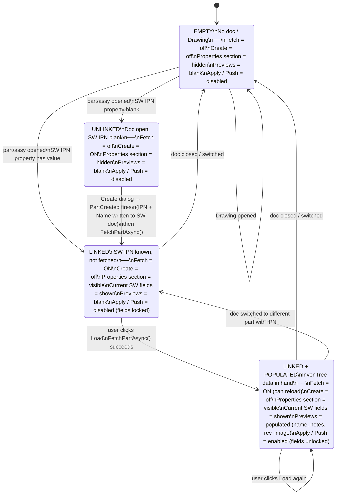

# Architecture

Module map of the add-in. Update this when files are added or deleted.

## Source tree

```
SwInventreeAddin/
  AddIn/
    SwAddin.cs              -- COM entry point, SolidWorks lifecycle, event wiring
  Config/
    IConfigProvider.cs          -- interface: GetServerConfig / SaveServerConfig
    ServerConfig.cs             -- data class: Url + ApiKey + MappingSourcePath (nullable)
    EncryptedConfigProvider.cs  -- DPAPI-encrypted file in %AppData%
    IPropertyMappingProvider.cs -- interface: GetMapping / SaveMapping / CopyToLocal / IsReadOnly
    PropertyMappingConfig.cs    -- data class: five SW property-name fields + schema version
    PropertyMappingProvider.cs  -- JSON file I/O; local-file > source-path > first-run-defaults
  InvenTree/
    IInventreeClient.cs     -- interface: GetPartByIpnAsync / PatchPartRevisionAsync / UpdatePartDescriptionAsync / UploadPartImageAsync
    InventreeHttpClient.cs  -- real HTTP client (System.Net.Http)
    InventreePart.cs        -- data class: Pk, Name, Notes, Revision, Ipn, Description
  SolidWorks/
    IDocumentPropertyService -- interface: get/set custom properties
    IViewportCaptureService  -- interface: capture viewport as Image
    SwDocumentPropertyService -- real SolidWorks implementation
  UI/
    TaskPaneControl.cs      -- ElementHost shim: wraps TaskPaneView for SolidWorks HWND
    TaskPaneViewModel.cs    -- MVVM business logic: fetch, compare, apply, push
    TaskPaneView.xaml       -- WPF layout for the task pane
    DesignTokens.xaml       -- shared colours, brushes, button styles
    SettingsWindow.xaml      -- WPF modal dialog for server URL + API key
    PushRevisionConfirmDialog.xaml -- WPF confirmation with image checkbox
    ImageCropWindow.xaml    -- WPF modal crop/preview dialog for viewport screenshots
    CropGeometry.cs         -- pure C# crop math (no UI dependency)
    ImagePipeline.cs        -- static: crop -> resize (800x800 max) -> PNG encode
```

## Data flow

1. SolidWorks loads SwAddin -> reads encrypted settings -> creates HTTP client
2. User opens a part -> SwAddin fires LoadPartNumber -> panel shows current properties
3. User clicks Fetch -> TaskPaneControl calls IInventreeClient -> displays comparison
4. User clicks Apply -> TaskPaneControl calls IDocumentPropertyService -> writes to part
5. User clicks Push Rev -> TaskPaneControl calls IInventreeClient.PatchPartRevisionAsync
6. User clicks Push Image -> capture viewport -> ImageCropWindow -> ImagePipeline -> IInventreeClient.UploadPartImageAsync

## Task pane state machine



**Single source of truth for the "populated" state: `FetchPartAsync()`.**
After a create, the `PartCreated` handler sets `PartNumber` and calls `FetchPartAsync()` directly —
it does not manually replicate the field-unlock logic.

## Design files

UI mockups are maintained in `docs/sw-addin-layout.pen` using Pencil, available via the
Pencil MCP server (`mcp__pencil__*` tools). Each window in `UI/` has a corresponding frame
in that file. Update the mockup when adding or changing screens.

## Module boundaries

| Module    | Depends on          | Must not know about     |
|-----------|---------------------|-------------------------|
| UI        | IInventreeClient, IDocumentPropertyService, IConfigProvider, IViewportCaptureService | HTTP details, SolidWorks API |
| InvenTree | System.Net.Http     | SolidWorks, UI          |
| Config    | System.Security (DPAPI), System.Text.Json | Everything else       |
| SolidWorks| SolidWorks.Interop  | InvenTree, Config       |
| AddIn     | All interfaces      | Implementation details  |
